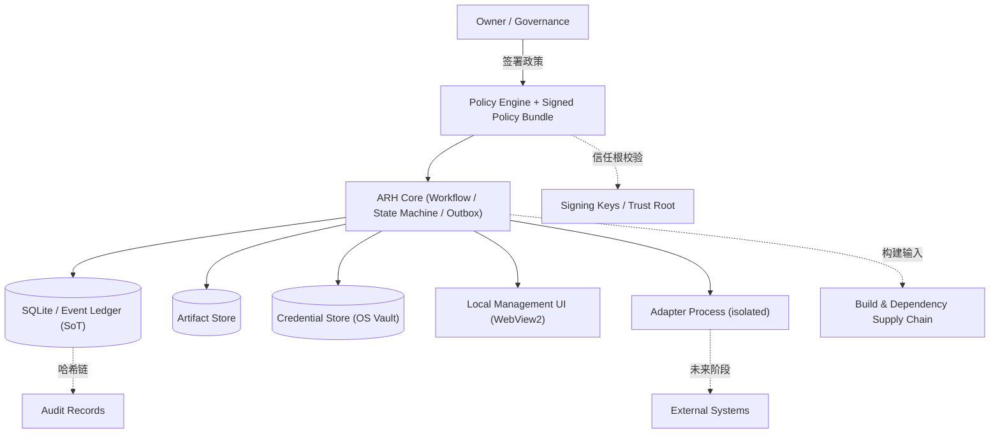

```text
Document Status: PROPOSED
Normative Status: 未批准，当前不是 Source of Truth
Product Baseline: AGENT_RELAY_HUB_PROJECT_PROPOSAL_v1.1.md
Product Baseline Commit: c9cc522b4ab01008fed390c282d6bd5a816ee779
Governance Baseline Commit: cf8e66b431b36103fb7c049048521c15df2e3701
Governance Approval Record: GOVERNANCE_APPROVAL_0001.md
Current Phase: Phase 0
Phase 1: NOT AUTHORIZED
Code Status: NO PRODUCT CODE
```

# SECURITY.md（安全与威胁模型）

> 本文件建立 ARH 安全目标、资产、信任边界、威胁模型与安全控制。
> 当前为 `PROPOSED`，未经 Reviewer-2 审核与 owner 批准前**不属于 Source of Truth**；
> 不得描述为已批准、已实现或已测试；不得自动关闭 Phase 0。
> 所有内容必须服从已批准 V1.1，且不与 V1.1 冲突。

---

## 1. 安全目标

- **最小权限**：每个角色仅得完成任务所需最小权限（V1.1 §15.1）。
- **fail-closed**：任何不确定/失败默认进入安全终态或降级，而非伪造完成。
- **可追溯**：所有权威变更、授权与凭据使用可经审计哈希链回溯。
- **凭据不泄漏**：明文凭据不落盘、不进日志、不进 prompt、不进截图。
- **外部声明不直接成为事实**：外部/模拟角色只能提交声明、结果与证据（V1.1 §12.4）。
- **政策完整性**：已签名政策包是授权唯一 SoT；篡改即进入 safe mode（V1.1 §15.5）。
- **安全停止优于伪造完成**：无法确认时安全停止，不谎报成功（V1.1 §16.3）。

---

## 2. 资产

- 源码（source code）
- policy bundle（签名政策包）
- event ledger（事件账本）
- artifacts（产物）
- credentials（凭据 / OS 凭据库引用）
- browser state（浏览器 storage state / Cookie / 用户目录 / 会话令牌）
- signing keys（签名密钥 / 信任根）
- audit records（审计记录）
- workflow authorization（工作流授权与 capability token）
- budget（预算计数）
- external system state（外部系统状态，仅经对账获得）

---

## 3. 参与者和攻击面

- **owner**：最终治理所有者；高价值社会工程目标。
- **governance approver**：被委派的治理批准角色。
- **coordinator**：调度与路由；可被诱导错误路由。
- **worker**：执行角色；可能被恶意 prompt/artifact 影响。
- **reviewer**：独立审核；其结论可被伪造或绕过。
- **malicious or compromised adapter**：伪造结果、越权、泄漏凭据。
- **malicious prompt/artifact**：prompt injection、路径遍历、命令注入。
- **local user**：本地提权、误用 UI 关闭安全门禁。
- **external service**：不可信返回、状态未知、重放。
- **supply-chain dependency**：恶意/被篡改依赖（见 §11）。

---

## 4. 信任边界



边界要点：

- Owner/Governance 与 Core 之间：仅通过签名政策与批准记录交互。
- Adapter Process 与 Core 之间：仅经 JSON-RPC 2.0 受限通道，不得直连核心 SQLite。
- Credential Store 与 Core 之间：适配器只获引用，不获明文。
- External Systems 在 Phase 3+ 才出现；Phase 1 不存在。

---

## 5. 威胁模型（STRIDE）

| Threat ID | Asset | Actor | Boundary | Scenario | Impact | Control | Detection | Residual Risk | Phase |
|---|---|---|---|---|---|---|---|---|---|
| T-01 | worker/prompt | malicious prompt/artifact | 外部文本→核心 | prompt injection 篡改任务/权限 | 越权执行 | 分层政策、外部文本不可改权限(§15.3) | Schema 校验、沙箱 | Low | P1 |
| T-02 | 核心命令 | malicious adapter | adapter→core | command injection 经产物/参数 | 任意命令 | 参数校验、白名单 | 审计异常 | Low | P1 |
| T-03 | artifact/filesystem | malicious adapter | adapter→core | path traversal 写越权路径 | 文件泄露 | 路径白名单 | 访问审计 | Low | P1 |
| T-04 | credentials | compromised adapter | adapter→cred | credential theft 窃取引用/值 | 凭据泄漏 | OS 凭据库、仅引用(§15.2) | 凭据使用事件 | Low | P1 |
| T-05 | policy bundle | local user/attacker | 政策文件 | policy tampering 改授权上限 | 提权 | 签名/锚点校验(§15.5) | 校验失败→safe mode | Low | P0 |
| T-06 | event ledger | attacker | ledger | ledger tampering 改事实 | 伪造终态 | 哈希链、只读派生 | 哈希不一致 | Low | P0 |
| T-07 | artifact | malicious adapter | artifact→core | artifact substitution 替换产物 | 错误证据 | SHA256 内容寻址(§12.3) | 哈希不匹配 | Low | P1 |
| T-08 | adapter host | malicious adapter | adapter process | adapter privilege escalation | 宿主失控 | 独立进程、网络默认拒绝(§10.4) | 超权限拒绝 | Low | P1 |
| T-09 | sub-agent | worker | worker→subagent | subagent privilege escalation | 隐性提权 | 继承父上限、禁提权(§4.2.2) | 越权留痕 | Low | P1 |
| T-10 | external action | external service | core→external | replay 重复外部副作用 | 双花/重复 | idempotency_key(§10) | 对账 | Medium | P3 |
| T-11 | external action | external service | core→external | duplicate external side effect | 重复执行 | RECONCILIATION_REQUIRED(§12.2) | 对账告警 | Medium | P1 |
| T-12 | release gate | malicious worker | worker→gate | fake completion 谎报完成 | 错误晋级 | worker 只生待验证事件(§11) | verifier 证据校验 | Low | P1 |
| T-13 | dependency | supply chain | build→core | malicious dependency 植入 | 远端控制 | SBOM 对账、签名(§11) | 哈希/签名失败阻断 | Medium | P1 |
| T-14 | audit/log | local user | UI→log | log/screenshot leakage | 凭据泄漏 | 默认脱敏、禁明文(§12) | 敏感字段扫描 | Low | P1 |
| T-15 | desktop UI | unsafe UIA | UI→desktop | unsafe UIA focus 误触 | 误操作 | UIA 仅降级、会话锁(§10.5) | 会话锁检测 | Medium | P3 |
| T-16 | desktop UI | local user | UI→desktop | session lock / UAC 绕过 | 提权 | 会话锁暂停桌面适配器(§4.3) | 锁状态检测 | Low | P3 |
| T-17 | budget | malicious adapter | adapter→core | budget abuse 耗尽预算 | 拒绝服务 | 三层预算上限(§9.1) | 预算告警 | Low | P1 |
| T-18 | approval record | local user/attacker | governance | approval forgery 伪批准 | 非法晋级 | 签名批准记录、可追溯(SoT §10) | 记录校验 | Low | P0 |

> 残余风险等级为 Phase 1 模拟环境下的设计预期；真实外部系统接入（Phase 3+）须重新评估。

---

## 6. 授权模型

- **授权档位 A0–A5**（V1.1 §4.2）：

  | 档位 | 行为 | 默认状态 |
  |---|---|---|
  | A0 观察 | 读取状态、生成摘要 | 允许 |
  | A1 研究 | 调用审核/规划工具、生成建议 | 允许 |
  | A2 隔离执行 | 沙箱/任务分支改文件、跑测试 | 允许 |
  | A3 交付候选 | commit/push 候选分支、建/更 PR | 允许 |
  | A4 非生产部署 | Demo/测试/临时环境部署 | 按预授权 |
  | A5 不可逆/生产 | 支付/删重要数据/合并受保护主分支/实盘/解除安全门禁 | 默认禁止 |

- **技术能力 ≠ 政策授权上限 ≠ 本次 capability token**：最终授权上限 = min(自报能力, 政策上限, 令牌权限)，由政策引擎裁决（V1.1 §4.2.1）。
- **子代理不超过父代理**：授权档位、预算、路径、域名、凭据、工具均继承最小上限，禁止隐性提权（V1.1 §4.2.2）。
- **Phase 1 只允许本地模拟环境授权**：不得向任何真实外部系统发起 A1–A5 动作。
- **A5 不因用户离线自动执行**：遇阻自动"不执行"，保留现状并写摘要（V1.1 §4.2）。

---

## 7. Policy Integrity Safe Mode

- 政策签名或可信锚点校验失败即进入 **`POLICY_INTEGRITY_SAFE_MODE`**（V1.1 §15.5）。
- safe mode **仅允许本地 A0 诊断**：查看本地状态、查看审计、导出脱敏诊断、由人工修复或重新签署政策。
- **禁止**：外部网络请求、模型调用、CLI 命令执行、Git 写入、浏览器自动化、桌面自动化（UIA）。
- **禁止 adapter fallback**：不自动切换备用适配器。
- **禁止自动恢复 A1–A5**。
- 只有可信政策重新加载并通过校验后才能退出 safe mode。
- 篡改政策包后任何外部 API/模型/CLI/浏览器/UIA 调用均被拒绝。

---

## 8. 密钥与信任根

> 以下为 Phase 1 提出的加密配置，**标记为待审核（pending review）**，尚未经 SECURITY.md 批准流程生效；本文档不写入任何真实密钥或 secret。

- 使用 **OS 保护的非对称签名密钥**（如 Windows CNG / Certificate Store 或等价 OS trust store）。
- 私钥尽可能 **不可导出**（non-exportable）。
- 使用 **SHA-256 内容摘要** 校验政策包与 SBOM。
- 签名 **MUST** 包含 key ID、算法、版本和目标哈希。
- **key rotation** 须有重叠验证窗口（old+new 同时可信直至窗口结束）。
- 须维护 **revocation list**；旧密钥撤销后 **MUST NOT** 继续签发。
- policy bundle 与 SBOM 的签名用途 **MUST** 分离，或通过明确 key purpose 区分。
- 信任根失败 **MUST NOT** 自动重建；须人工修复并重新签署。
- 具体签名密钥、信任根机制、轮换与撤销由后续 `SECURITY.md` 批准流程与 `SBOM_POLICY.md` 固定（当前 Phase 0 未关闭前不得定稿）。

---

## 9. 凭据

- 使用 **Windows Credential Manager**，后续接 **Vault**（V1.1 §13.3、§15.2）。
- browser Cookie / storage state / 用户目录 / 会话令牌 **视同凭据**，按 §14.2 隔离处理。
- **不入 Git**、不进 prompt、不进普通日志、不进截图。
- 最小范围临时注入；使用后清理。
- 记录凭据使用事件但 **不记录值**。
- 支持过期、轮换、撤销。
- 泄漏检测与熔断（见 §15.4 全局熔断）。

---

## 10. 插件与执行隔离

- **独立进程**运行插件/适配器（V1.1 §10.4）。
- **禁止直接访问核心 SQLite**：只能经核心 API 提交声明/结果与证据。
- **路径/域名/命令白名单**：超范围请求由政策引擎拒绝。
- **网络默认拒绝**：插件出网须经显式政策授权。
- **verifier 沙箱默认无网络**：evidence_verifier 沙箱默认阻断出网、限制文件系统白名单（V1.1 §15.3）。
- **资源限制**：CPU/内存/执行时间上限。
- **超权限拒绝**：越权请求立即拒绝并留痕。
- **崩溃熔断**：同插件 10 分钟内崩溃超 3 次则停用并告警，不无限重启（V1.1 §10.4、§9.1）。
- **能力丢失安全终态**：运行中适配器丢失关键能力时在途 job 触发重路由或安全终态。

---

## 11. 供应链

引用：`LICENSE.md`、`THIRD_PARTY_LICENSES.md`、`SBOM_POLICY.md`。

- **未批准依赖不得进入**（THIRD_PARTY_LICENSES.md 登记后方可引入）。
- **lockfile** 锁定传递依赖。
- **hash** 校验每个组件（SHA256）。
- **provenance**：记录来源与构建输入。
- **SBOM 对账**：SBOM 须与 lockfile / 解析图 / 实际构建输入对账（SBOM_POLICY.md）。
- **签名失败阻断**：组件或 SBOM 签名校验失败 MUST 阻断发布。

---

## 12. 日志与审计

- 本地 **哈希链** 提供可验证与篡改检测（每事件带前序哈希）。
- **不宣称外部不可变**：仅保证本地可验证，不声称跨系统不可篡改。
- **默认脱敏**：敏感字段替换 + 默认开启；关闭需显式策略授权并留审计（V1.1 §15.3）。
- **明确禁止字段**：明文 secret、未脱敏 Cookie、browser storage state、完整会话令牌不得入日志。
- **截图关闭需显式策略授权**：关闭脱敏 MUST 经策略授权并留审计。
- **audit 不保存明文 secret**：审计记录只存引用与摘要。

---

## 13. 安全测试

至少定义以下测试（Phase 1 在模拟环境内执行，不接真实外部系统）：

- **policy tamper test**：篡改政策包 → 必须进入 safe mode。
- **path escape**：越权路径写入 → 必须被白名单拒绝。
- **command injection**：恶意参数 → 必须被校验拒绝。
- **prompt injection**：不可信文本 → 不得修改权限/预算/目标。
- **credential leak**：凭据值 → 不得出现在日志/截图/账本。
- **replay**：重复消息 → 必须由 idempotency_key 去重。
- **external state unknown**：状态未知 → 进入 RECONCILIATION_REQUIRED，不盲重发。
- **subagent escalation**：子代理提权 → 必须被政策引擎拒绝。
- **malicious adapter**：伪造结果 → 必须被 verifier/对账发现。
- **ledger/projection corruption**：篡改事件 → 哈希链检测，projection 重建一致。
- **backup tampering**：备份哈希不一致 → 不得宣称恢复成功。
- **safe-mode denial tests**：safe mode 下 A1–A5 动作 → 必须全部拒绝。
